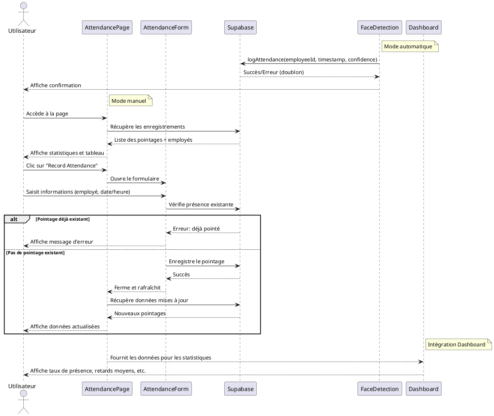

### Nom de la fonctionnalité & But
**Suivi de présence (Attendance Tracking) pour la gestion des pointages employés**

---

## Manuel d'utilisation

1. **Prérequis** :
   - Accès à l'application (interface Attendance Management)
   - Compte Supabase configuré (variables `.env`)
   - Employés existants dans la base

2. **Démarrage** :
   - Accéder à la page "Attendance Management" depuis le menu administrateur
   - Visualiser les enregistrements de présence existants dans le tableau
   - Consulter les statistiques (Nombre total, À l'heure, En retard)
   - Utiliser le bouton "Record Attendance" pour créer un nouveau pointage manuel

3. **Flux utilisateur** :
   - Un administrateur crée un pointage manuel via le formulaire
   - Alternativement, la détection faciale peut enregistrer automatiquement une présence
   - Les pointages sont visibles dans le tableau avec statut (À l'heure/En retard)
   - Les statistiques de présence s'affichent également sur le dashboard
   - Les données peuvent être filtrées, triées et paginées

---

## Diagramme UML de Séquence (PlantUML)



---

## Explication détaillée de la logique

### 1. Sources d'enregistrement des présences
- **Mode manuel** : Saisie via le formulaire `AttendanceForm`
  - Sélection de l'employé, date/heure de pointage
  - Vérification qu'un pointage n'existe pas déjà pour cet employé à cette date
  - Enregistrement dans la table `attendance` de Supabase
- **Mode automatique** : Via la détection faciale
  - Reconnaissance de l'employé par son visage
  - Le module `useFaceDetection` appelle `logAttendance()` 
  - Vérification qu'un pointage n'existe pas déjà pour aujourd'hui

### 2. Calcul des retards
- Utilisation de `CONFIG.LATE_THRESHOLD_HOUR` et `CONFIG.LATE_THRESHOLD_MINUTE` depuis `CONFIG.js`
- Fonction `isLate()` compare l'heure de pointage avec ces seuils
- Calcul et stockage du retard en minutes dans le champ `lateness`
- Indication visuelle dans l'interface (statut "On Time" en vert ou "Late" en jaune)

### 3. Affichage et interactions
- **Tableau des présences** :
  - Liste des pointages avec tri, filtrage, pagination
  - Affichage du statut de chaque pointage
  - Possibilité d'éditer un enregistrement
- **Statistiques** :
  - Nombre total de pointages
  - Nombre de pointages à l'heure
  - Nombre de pointages en retard

### 4. Intégration avec d'autres modules
- **Gestion des employés** : Récupération des données employés via `useFetchEmployees()`
- **Détection faciale** : Alimentation automatique via `logAttendance()`
- **Dashboard** : Affichage des statistiques de présence agrégées
  - Taux de présence global (`AttendanceRateOverTime`)
  - Retards moyens (`AverageLatenessOverTime`)

---

## Configuration & Setup

- **Variables d'environnement** :
  - `VITE_SUPABASE_URL`, `VITE_SUPABASE_ANON_KEY`
- **Table** :
  - `attendance` (voir database.md)
- **Configuration des seuils** :
  - Dans `CONFIG.js` : `LATE_THRESHOLD_HOUR`, `LATE_THRESHOLD_MINUTE`
  - Modifiables via l'interface `SettingsPage`

---

## Exemples d'utilisation avancés

```js
// Récupération des enregistrements de présence depuis Supabase
const fetchAttendanceRecords = async () => {
  try {
    const { data, error } = await supabase
      .from('attendance')
      .select(`
        id, 
        checkdate, 
        status, 
        lateness, 
        confidence_score,
        employees (id, name)
      `)
      .order('checkdate', { ascending: false });

    if (error) throw error;
    
    // Transformation pour l'affichage
    const formattedRecords = data.map(record => ({
      ...record,
      employee_name: record.employees?.name || 'Unknown',
      late: isLate(record.checkdate)
    }));
    
    setAttendanceRecords(formattedRecords);
  } catch (error) {
    setError('Error fetching attendance records');
  }
};

// Vérification et création d'un pointage
const createAttendanceRecord = async (employeeId, checkdate) => {
  // Vérifier si un pointage existe déjà aujourd'hui
  const today = new Date(checkdate);
  today.setHours(0, 0, 0, 0);
  const tomorrow = new Date(today);
  tomorrow.setDate(tomorrow.getDate() + 1);

  const { data: existing } = await supabase
    .from('attendance')
    .select('id')
    .eq('employee_id', employeeId)
    .gte('checkdate', today.toISOString())
    .lt('checkdate', tomorrow.toISOString())
    .limit(1);

  if (existing && existing.length > 0) {
    return { success: false, error: 'Pointage déjà effectué aujourd\'hui' };
  }

  // Calculer le retard éventuel
  const checkInTime = new Date(checkdate);
  let lateness = null;
  if (isLate(checkdate)) {
    const thresholdTime = new Date(checkdate);
    thresholdTime.setHours(CONFIG.LATE_THRESHOLD_HOUR, CONFIG.LATE_THRESHOLD_MINUTE, 0, 0);
    const latenessMs = checkInTime - thresholdTime;
    lateness = `${Math.floor(latenessMs / (1000 * 60))} minutes`;
  }

  // Insérer le pointage
  const { error } = await supabase
    .from('attendance')
    .insert([{
      employee_id: employeeId,
      checkdate: checkdate,
      status: 'present',
      lateness: lateness
    }]);

  return { success: !error, error: error?.message };
};
```

---

## Liens & Références

- [Supabase documentation](https://supabase.com/docs)
- [React Table](https://react-table.tanstack.com/)
- Fichiers sources :
  - `src/pages/AttendancePage.jsx`
  - `src/components/AttendanceForm.jsx`
  - `src/utils/logAttendance.js`
  - `src/utils/CONFIG.js`
  - `src/pages/DashboardPage.jsx` (intégration stats) 