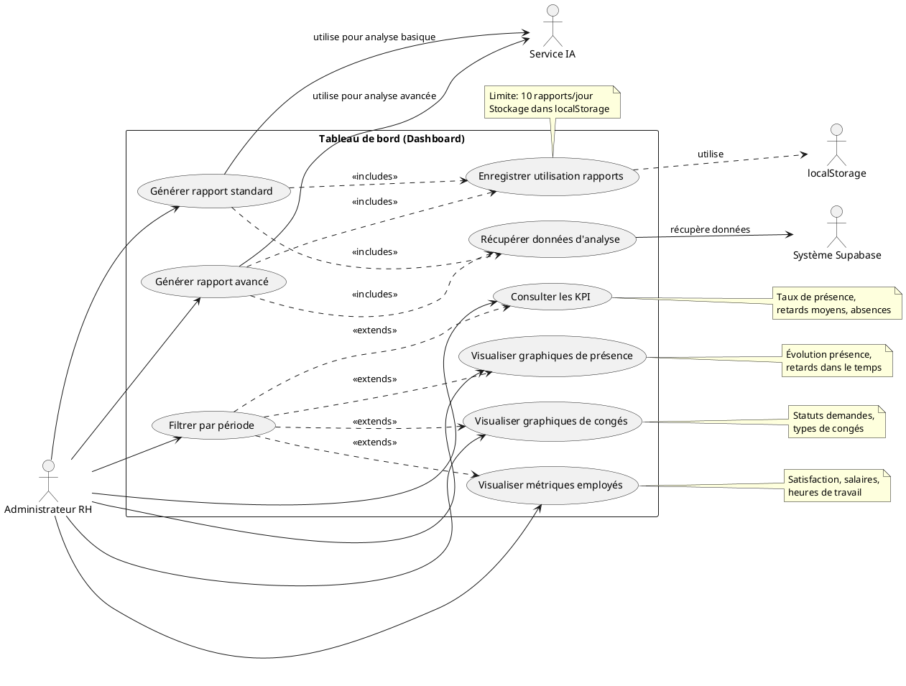

### Nom de la fonctionnalité & But
**Tableau de bord analytique pour la visualisation des métriques RH et la génération de rapports IA**

---

## Manuel d'utilisation

1. **Prérequis** :
   - Accès à l'application (interface administrateur)
   - Compte Supabase configuré (variables `.env`)
   - Données présentes dans les modules associés (employés, présence, congés)

2. **Démarrage** :
   - Accéder à la page "Dashboard" depuis le menu administrateur
   - Sélectionner la période d'analyse souhaitée (semaine, mois, année)
   - Consulter les indicateurs clés de performance (KPI) en haut de page
   - Explorer les différents graphiques dans la grille de visualisation
   - Générer un rapport IA via le bouton dédié

3. **Flux utilisateur** :
   - **Consultation des statistiques** :
     - Utiliser les filtres de période pour ajuster la vue
     - Consulter les cartes de statistiques (taux de présence, retards moyens, absences)
     - Explorer les graphiques détaillés (tendances, distributions, comparaisons)
   - **Génération de rapports** :
     - Cliquer sur la carte "Generate Report"
     - Choisir le type de rapport (standard ou avancé)
     - Confirmer la génération (consomme 1 crédits sur les 10 quotidiens)
     - Visualiser et explorer les insights générés par l'IA

---

## Diagramme UML de Cas d'Utilisation (PlantUML)



---

## Explication détaillée de la logique

### 1. Architecture du tableau de bord
- **Structure modulaire** :
  - Conteneur principal `DashboardPage` orchestre les composants
  - Composants de période pour filtrer les données (`TimeSelector`)
  - Cartes de statistiques pour les KPI principaux
  - Grille de graphiques pour les visualisations détaillées
  - Carte spéciale pour la génération de rapports IA

- **Gestion de l'état** :
  - Période sélectionnée (`period`: semaine, mois, année)
  - Données de présence filtrées (`filteredAttendance`)
  - Compteur de rapports disponibles (`reportsLeft`)
  - États modaux pour les rapports IA

### 2. Indicateurs clés de performance (KPI)
- **Taux de présence** :
  - Calcul: nombre de présences / nombre total d'enregistrements * 100
  - Affichage en pourcentage avec compteur précis
  - Source: table `attendance`, filtrée par période

- **Retard moyen** :
  - Calcul: somme des minutes de retard / nombre de retards
  - Affichage en minutes avec indicateur coloré
  - Source: champ `lateness` dans `attendance`

- **Absences** :
  - Comptage des statuts "absent" dans la période
  - Affichage du nombre absolu et pourcentage
  - Source: enregistrements avec `status = 'absent'`

### 3. Graphiques analytiques
- **Graphiques temporels** :
  - `AttendanceRateOverTime`: évolution du taux de présence
  - `AverageLatenessOverTime`: évolution des retards moyens
  - `NewHiresOverTime`: recrutements au fil du temps

- **Graphiques de distribution** :
  - `EmployeeSatisfactionByDepartement`: satisfaction par département
  - `LeaveBalanceDistribution`: répartition des soldes de congés
  - `WeeklyWorkHoursVsSalary`: corrélation heures/salaire

- **Graphiques d'analyse** :
  - `LeaveRequestsByStatus`: statuts des demandes de congés
  - `LeavesTakenByType`: types de congés utilisés

### 4. Système de rapports IA
- **Types de rapports** :
  - Standard: analyse basique des données et tendances
  - Enrichi: analyse approfondie avec prévisions et recommandations

- **Limitation d'usage** :
  - 10 rapports maximum par jour (quota stocké dans localStorage)
  - Compteur réinitialisé quotidiennement
  - Vérification et gestion des rapports mis en cache

- **Processus de génération** :
  - Extraction des données pertinentes depuis Supabase
  - Traitement et analyse par les services d'IA
  - Mise en forme et présentation dans des modals dédiés

### 5. Intégration avec d'autres modules
- **Gestion des employés** :
  - Métriques de satisfaction et performance
  - Analyse des nouveaux recrutements
  - Distribution des salaires et heures de travail

- **Suivi de présence** :
  - Taux de présence global et par département
  - Analyse des retards et tendances
  - Impact des politiques de présence

- **Gestion des congés** :
  - Distribution et états des demandes
  - Analyse des types de congés utilisés
  - Suivi des soldes disponibles

---

## Configuration & Setup

- **Variables d'environnement** :
  - `VITE_SUPABASE_URL`, `VITE_SUPABASE_ANON_KEY`
  - Configurations éventuelles des API d'IA tierces

- **Configuration des rapports** :
  - `MAX_DAILY_REPORTS`: nombre maximum de rapports par jour
  - `REPORTS_STORAGE_KEY`: clé localStorage pour le suivi d'utilisation

- **Dépendances** :
  - `react-apexcharts`: bibliothèque de visualisation
  - `date-fns`: manipulation des dates et périodes
  - Modules d'IA pour la génération de rapports

---

## Exemples d'utilisation avancés

```js
// Génération d'un rapport IA avancé
const generateAIReport = async () => {
  try {
    // 1. Extraction de données consolidées de différentes sources
    const [attendanceData, employeesData, leavesData] = await Promise.all([
      fetchAttendanceAnalytics(),
      fetchEmployeeMetrics(),
      fetchLeaveStatistics()
    ]);

    // 2. Préparation du contexte d'analyse
    const analysisContext = {
      timeframe: period, // 'week', 'month', 'year'
      attendanceMetrics: {
        rate: calculateAttendanceRate(attendanceData),
        lateness: calculateAverageLateness(attendanceData),
        trends: identifyAttendanceTrends(attendanceData)
      },
      employeeInsights: {
        satisfaction: aggregateSatisfactionScores(employeesData),
        turnover: calculateTurnoverRate(employeesData),
        performance: correlateAttendanceWithPerformance(attendanceData, employeesData)
      },
      leaveAnalysis: {
        distribution: categorizeLeaveTypes(leavesData),
        patterns: identifyLeavePatterns(leavesData),
        impact: assessLeaveImpact(leavesData, attendanceData)
      }
    };

    // 3. Génération du rapport par le service IA
    const report = await aiAnalysisService.generateReport(analysisContext);

    // 4. Post-traitement et enrichissement
    const enhancedReport = {
      ...report,
      generatedAt: new Date().toISOString(),
      visualizations: generateSupplementaryCharts(report.insights),
      recommendations: prioritizeRecommendations(report.recommendations),
      predictiveAnalytics: generatePredictions(analysisContext, report.trends)
    };

    return enhancedReport;
  } catch (error) {
    console.error('Error generating AI report:', error);
    throw new Error('Failed to generate report. Please try again later.');
  }
};

// Extraction et mise en forme des données pour les graphiques
const prepareChartData = (chartType, period) => {
  switch (chartType) {
    case 'attendanceRate':
      // Données pour le graphique d'évolution du taux de présence
      return {
        series: [{
          name: 'Taux de présence',
          data: calculateRateByPeriod(attendanceData, period)
        }],
        options: {
          chart: { type: 'line', height: 350 },
          stroke: { curve: 'smooth', width: 3 },
          colors: ['#34D399'],
          fill: {
            type: 'gradient',
            gradient: {
              shade: 'dark',
              gradientToColors: ['#3B82F6'],
              shadeIntensity: 1,
              type: 'horizontal',
              opacityFrom: 0.7,
              opacityTo: 1
            }
          },
          // Configuration supplémentaire...
        }
      };
    
    case 'departmentSatisfaction':
      // Données pour le graphique de satisfaction par département
      return {
        series: departmentsData.map(dept => dept.satisfactionScore),
        options: {
          chart: { type: 'radar' },
          labels: departmentsData.map(dept => dept.name),
          // Configuration supplémentaire...
        }
      };
    
    // Autres types de graphiques...
  }
};
```

---

## Liens & Références

- [ApexCharts Documentation](https://apexcharts.com/docs/react-charts/)
- [Date-fns Documentation](https://date-fns.org/)
- [Supabase documentation](https://supabase.com/docs)
- [OpenAI API](https://platform.openai.com/docs/api-reference) (si utilisée pour les rapports IA)
- Fichiers sources :
  - `src/pages/DashboardPage.jsx`
  - `src/charts/` (dossier des composants graphiques)
  - `src/components/EnhancedReportModal.jsx`
  - `src/utils/enhancedReportGenerator.js` 