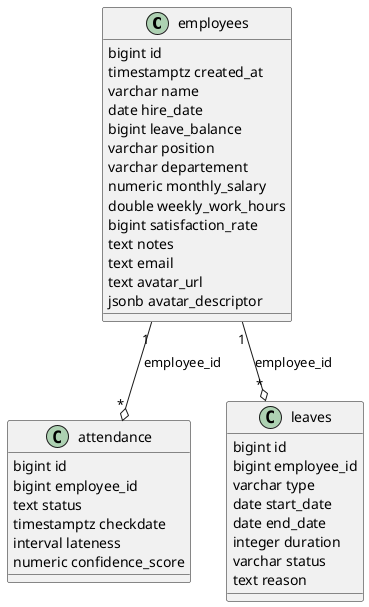

### Documentation de la base de données Supabase

---

## Vue d'ensemble

La base de données Supabase du projet gère les employés, la présence (pointage) et les congés. Elle est structurée autour de trois tables principales : `employees`, `attendance`, et `leaves`. Les relations sont assurées via des clés étrangères.

---

## Tables principales

### 1. `employees`
- **Description** : Stocke les informations de chaque employé.
- **Colonnes** :
  | Nom                | Type                | Contraintes / Description                                  |
  |--------------------|---------------------|------------------------------------------------------------|
  | id                 | bigint              | PK, auto-incrémenté                                        |
  | created_at         | timestamptz         | Date de création (défaut: now())                           |
  | name               | varchar             | Nom de l'employé, requis                                   |
  | hire_date          | date                | Date d'embauche                                            |
  | leave_balance      | bigint              | Solde de congés                                            |
  | position           | varchar             | Poste                                                      |
  | departement        | varchar             | Département                                                |
  | monthly_salary     | numeric             | Salaire mensuel                                            |
  | weekly_work_hours  | double precision    | Heures de travail hebdo                                    |
  | satisfaction_rate  | bigint              | Taux de satisfaction                                       |
  | notes              | text                | Notes libres                                               |
  | email              | text                | Unique, format email, optionnel                            |
  | avatar_url         | text                | URL de l'avatar (stocké dans Supabase Storage)             |
  | avatar_descriptor  | jsonb               | Descripteur facial (pour reconnaissance faciale)           |

- **Contraintes** :
  - `id` : clé primaire
  - `email` : unique, format email

---

### 2. `attendance`
- **Description** : Journalise chaque pointage de présence d'un employé.
- **Colonnes** :
  | Nom              | Type                | Contraintes / Description                                  |
  |------------------|---------------------|------------------------------------------------------------|
  | id               | bigint              | PK, auto-incrémenté                                        |
  | employee_id      | bigint              | FK → employees.id, requis                                  |
  | status           | text                | 'present' ou 'absent'                                      |
  | checkdate        | timestamptz         | Date et heure du pointage                                  |
  | lateness         | interval            | Retard (calculé selon l'heure de pointage)                 |
  | confidence_score | numeric             | Score de confiance de la reconnaissance faciale            |

- **Contraintes** :
  - `id` : clé primaire
  - `employee_id` : clé étrangère vers `employees.id`
  - `status` : doit être 'present' ou 'absent'

---

### 3. `leaves`
- **Description** : Gère les demandes de congés des employés.
- **Colonnes** :
  | Nom           | Type                | Contraintes / Description                                  |
  |---------------|---------------------|------------------------------------------------------------|
  | id            | bigint              | PK, auto-incrémenté                                        |
  | employee_id   | bigint              | FK → employees.id                                          |
  | type          | varchar             | Type de congé (ex: maladie, annuel, etc.)                  |
  | start_date    | date                | Date de début                                              |
  | end_date      | date                | Date de fin                                                |
  | duration      | integer             | Durée (en jours)                                           |
  | status        | varchar             | Statut ('pending', 'approved', 'rejected', etc.)           |
  | reason        | text                | Motif du congé                                             |

- **Contraintes** :
  - `id` : clé primaire
  - `employee_id` : clé étrangère vers `employees.id`

---

## Relations et schéma UML (PlantUML)



---

## Explications et flux principaux

- **Ajout d'un employé** : Insertion dans `employees`, possibilité d'ajouter un avatar et un descripteur facial.
- **Pointage de présence** :
  - Un enregistrement est ajouté à `attendance` avec l'heure, le score de confiance, et le statut.
  - Le pointage est lié à un employé via `employee_id`.
- **Gestion des congés** :
  - Les demandes sont créées dans `leaves` et liées à l'employé.
  - Le statut évolue selon le traitement (pending, approved, etc).

---

## Exemples d'utilisation SQL

```sql
-- Récupérer tous les employés avec leur dernier pointage
SELECT e.*, a.checkdate, a.status
FROM employees e
LEFT JOIN attendance a ON a.employee_id = e.id
ORDER BY a.checkdate DESC;

-- Ajouter un pointage
INSERT INTO attendance (employee_id, status, checkdate, confidence_score)
VALUES (1, 'present', NOW(), 0.92);

-- Demander un congé
INSERT INTO leaves (employee_id, type, start_date, end_date, status, reason)
VALUES (1, 'annuel', '2024-07-01', '2024-07-10', 'pending', 'Vacances annuelles');
```

---

## Références
- [Supabase documentation](https://supabase.com/docs)
- [PlantUML](https://plantuml.com/) 