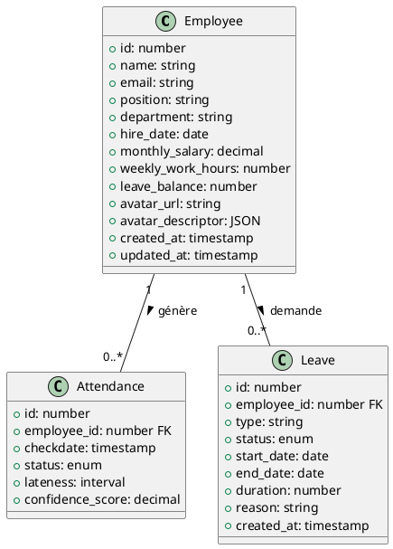
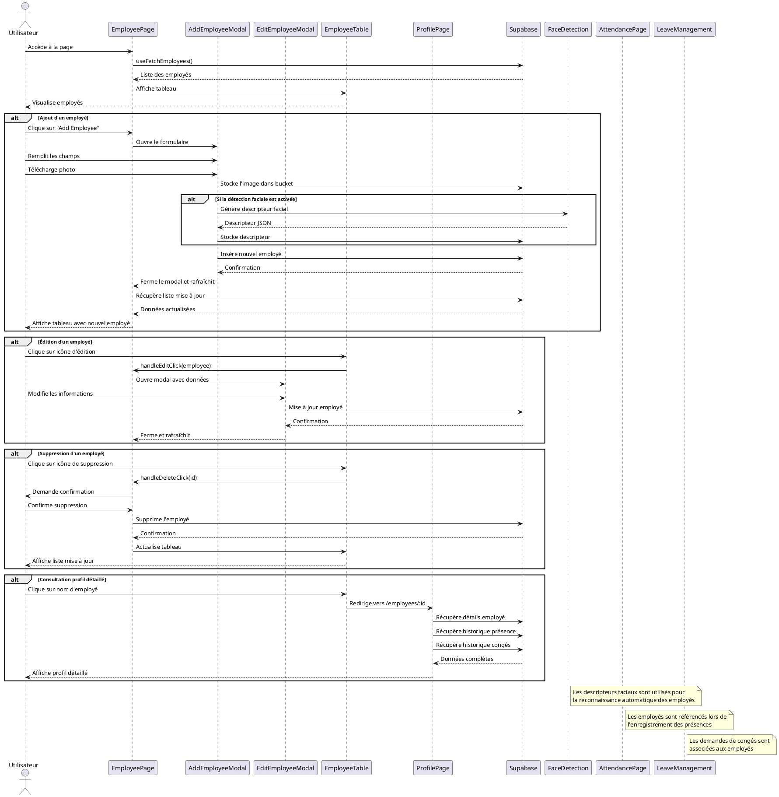

### Nom de la fonctionnalité & But
**Gestion des employés pour l'administration du personnel et intégration avec les modules**

---

## Manuel d'utilisation

1. **Prérequis** :
   - Accès à l'application (interface administrateur)
   - Compte Supabase configuré (variables `.env`)
   - Droits d'administration sur la gestion du personnel

2. **Démarrage** :
   - Accéder à la page "Employees" depuis le menu administrateur
   - Visualiser la liste des employés existants (tableau avec filtre, tri)
   - Utiliser le bouton "Add Employee" pour créer un nouvel employé
   - Cliquer sur un nom pour accéder à la page détaillée du profil

3. **Flux utilisateur** :
   - **Ajout d'un employé** :
     - Cliquer sur "Add Employee"
     - Remplir le formulaire (nom, email, poste, date d'embauche, etc.)
     - Télécharger une photo de profil (utilisée pour la détection faciale)
     - Soumettre le formulaire
   - **Modification d'un employé** :
     - Cliquer sur l'icône d'édition dans la liste
     - Modifier les informations dans le formulaire
     - Soumettre les changements
   - **Suppression d'un employé** :
     - Cliquer sur l'icône de suppression
     - Confirmer la suppression (attention : impact sur les données liées)
   - **Consultation du profil détaillé** :
     - Historique de présence
     - Historique des congés
     - Statistiques personnelles

---

## Diagramme UML de Class/Séquence (PlantUML)





---

## Explication détaillée de la logique

### 1. Structure des données employés
- **Informations de base** :
  - Identifiants (id, nom, email)
  - Informations professionnelles (poste, département, date d'embauche)
  - Données contractuelles (salaire, heures hebdomadaires)
  - Solde de congés (leave_balance)
  - Avatar et descripteur facial pour la reconnaissance

- **Table Supabase** :
  - Table `employees` (voir database.md)
  - Relations vers `attendance` et `leaves` (clés étrangères)
  - Stockage des photos dans Supabase Storage (bucket)
  - Descripteurs faciaux stockés en JSON pour la reconnaissance

### 2. Flux d'ajout/modification des employés
- **Formulaire d'ajout** :
  - Composant `AddEmployeeModal` avec validation des champs
  - Upload d'image avec prévisualisation
  - Génération optionnelle du descripteur facial à l'enregistrement
  - Insertion dans Supabase avec gestion d'erreur

- **Formulaire d'édition** :
  - Composant `EditEmployeeModal` pré-rempli avec les données existantes
  - Support pour la modification de l'avatar
  - Mise à jour du descripteur facial si l'image change
  - Transaction Supabase pour mise à jour atomique

- **Suppression** :
  - Vérification des dépendances (présences, congés)
  - Confirmation utilisateur avec avertissement
  - Suppression Supabase avec cascade ou blocage selon la configuration

### 3. Visualisation des employés
- **Tableau interactif** :
  - Composant `EmployeeTable` avec tri, filtre, pagination
  - Rendu optimisé avec animations de transition
  - Actions contextuelles (éditer, supprimer, voir profil)
  - Indicateurs visuels (avatars, statuts)

- **Profil détaillé** :
  - Page `ProfilePage` avec tous les détails d'un employé
  - Historique de présence et statistiques (ponctualité, taux de présence)
  - Historique et statut des demandes de congés
  - Graphiques de performance et d'assiduité

### 4. Intégration avec d'autres modules
- **Détection faciale** :
  - Utilisation des descripteurs faciaux pour la reconnaissance
  - Création automatique des descripteurs lors de l'ajout/modification
  - Lien avec le module de détection pour l'enregistrement des présences

- **Gestion des présences** :
  - Référencement des employés lors des pointages
  - Visualisation des statistiques de présence sur le profil
  - Impact des paramètres de retard configurés

- **Gestion des congés** :
  - Association des demandes de congés aux employés
  - Vérification des soldes disponibles
  - Historique et statut des demandes sur le profil

- **Dashboard** :
  - Alimentation des graphiques de présence, satisfaction, coûts
  - Métriques RH basées sur les données employés
  - Statistiques départementales et par équipe

---

## Configuration & Setup

- **Variables d'environnement** :
  - `VITE_SUPABASE_URL`, `VITE_SUPABASE_ANON_KEY`
- **Structure Supabase** :
  - Table `employees` (voir database.md)
  - Bucket Storage pour les avatars
  - Relations RLS (Row Level Security) pour la sécurité
- **Routes d'accès** :
  - `/admin/employees` : Liste des employés
  - `/admin/employees/:id` : Profil détaillé

---

## Exemples d'utilisation avancés

```js
// Hook personnalisé pour la gestion des employés
import { useState, useEffect, useCallback } from 'react';
import supabase from '../database/supabase-client';
import { extractFaceDescriptorFromImage } from '../utils/faceDetectionUtils';

export const useEmployeeManagement = () => {
  const [employees, setEmployees] = useState([]);
  const [loading, setLoading] = useState(true);
  const [error, setError] = useState(null);

  // Récupération des employés
  const fetchEmployees = useCallback(async () => {
    try {
      setLoading(true);
      const { data, error } = await supabase
        .from('employees')
        .select('*')
        .order('name');

      if (error) throw error;
      setEmployees(data || []);
    } catch (err) {
      console.error('Error fetching employees:', err);
      setError(err.message);
    } finally {
      setLoading(false);
    }
  }, []);

  // Ajout d'un employé avec traitement d'avatar et descripteur facial
  const addEmployee = async (employeeData, avatarFile) => {
    try {
      // 1. Upload de l'avatar si fourni
      let avatarUrl = null;
      let descriptorJSON = null;

      if (avatarFile) {
        // Génération d'un nom de fichier unique
        const fileExt = avatarFile.name.split('.').pop();
        const fileName = `${Date.now()}-${Math.random().toString(36).substring(2)}.${fileExt}`;
        const filePath = `avatars/${fileName}`;

        // Upload vers Supabase Storage
        const { data: uploadData, error: uploadError } = await supabase.storage
          .from('employee-avatars')
          .upload(filePath, avatarFile, {
            cacheControl: '3600',
            upsert: false
          });

        if (uploadError) throw uploadError;
        
        // Récupération de l'URL publique
        const { data: { publicUrl } } = supabase.storage
          .from('employee-avatars')
          .getPublicUrl(filePath);
          
        avatarUrl = publicUrl;

        // 2. Extraction du descripteur facial
        try {
          const descriptor = await extractFaceDescriptorFromImage(avatarUrl);
          if (descriptor) {
            descriptorJSON = JSON.stringify(Array.from(descriptor));
          }
        } catch (descriptorError) {
          console.warn('Could not extract face descriptor:', descriptorError);
          // On continue même sans descripteur
        }
      }

      // 3. Insertion de l'employé avec les données complètes
      const { data, error } = await supabase
        .from('employees')
        .insert([{
          ...employeeData,
          avatar_url: avatarUrl,
          avatar_descriptor: descriptorJSON,
          created_at: new Date()
        }])
        .select();

      if (error) throw error;
      
      return { success: true, data: data[0] };
    } catch (err) {
      console.error('Error adding employee:', err);
      return { success: false, error: err.message };
    }
  };

  // Suppression d'un employé et ses références
  const deleteEmployee = async (employeeId) => {
    try {
      // 1. Récupération de l'URL de l'avatar pour suppression ultérieure
      const { data: employeeData } = await supabase
        .from('employees')
        .select('avatar_url')
        .eq('id', employeeId)
        .single();

      // 2. Suppression des enregistrements liés (si pas de contraintes FK)
      await supabase.from('attendance').delete().eq('employee_id', employeeId);
      await supabase.from('leaves').delete().eq('employee_id', employeeId);

      // 3. Suppression de l'employé
      const { error } = await supabase
        .from('employees')
        .delete()
        .eq('id', employeeId);

      if (error) throw error;

      // 4. Suppression de l'avatar si présent
      if (employeeData?.avatar_url) {
        const avatarPath = employeeData.avatar_url.split('/').pop();
        await supabase.storage
          .from('employee-avatars')
          .remove([`avatars/${avatarPath}`]);
      }

      return { success: true };
    } catch (err) {
      console.error('Error deleting employee:', err);
      return { success: false, error: err.message };
    }
  };

  // Initialisation
  useEffect(() => {
    fetchEmployees();
  }, [fetchEmployees]);

  return {
    employees,
    loading,
    error,
    fetchEmployees,
    addEmployee,
    deleteEmployee
  };
};
```

---

## Liens & Références

- [Supabase documentation](https://supabase.com/docs)
- [React Table](https://react-table.tanstack.com/)
- [face-api.js](https://github.com/justadudewhohacks/face-api.js)
- Fichiers sources :
  - `src/pages/EmployeePage.jsx`
  - `src/components/EmployeeTable.jsx`
  - `src/components/AddEmployeeModal.jsx`
  - `src/pages/ProfilePage.jsx` 