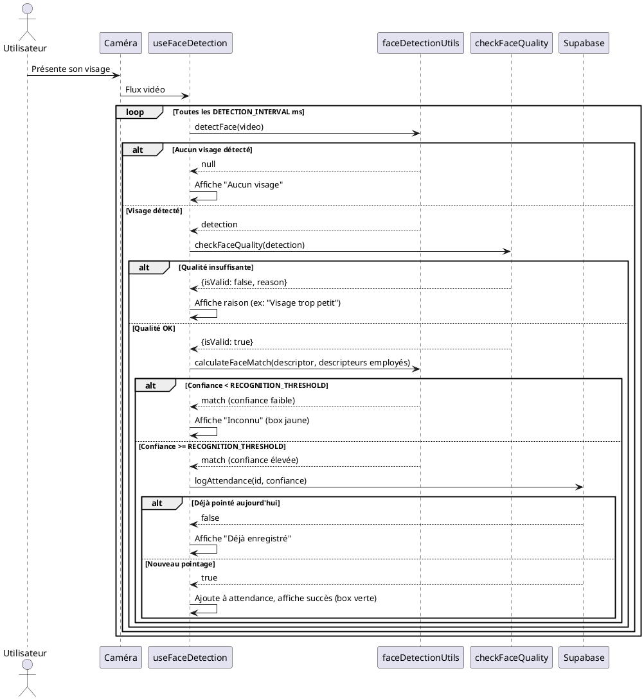

### Nom de la fonctionnalité & But
**Détection faciale automatisée pour la gestion de présence des employés**

---

## Manuel d'utilisation

1. **Prérequis** :
   - Navigateur compatible (Chrome/Firefox recommandé)
   - Accès à la caméra
   - Compte Supabase configuré (variables d'environnement `.env` : `VITE_SUPABASE_URL`, `VITE_SUPABASE_ANON_KEY`)
   - Modèles `face-api.js` disponibles dans `/public/models`

2. **Démarrage** :
   - Lancer l'application (`npm run dev`)
   - Accéder à la page de détection faciale (ex : `/attendance`)
   - Autoriser l'accès à la caméra
   - La détection commence automatiquement, les présences sont enregistrées en base Supabase

3. **Flux utilisateur** :
   - L'utilisateur se place devant la caméra
   - Le système détecte le visage, vérifie la qualité, compare avec la base d'employés
   - Si correspondance trouvée, la présence est enregistrée
   - L'utilisateur est notifié du résultat (succès, échec, qualité insuffisante)

---

## Diagramme UML de Séquence Avancé (PlantUML)



---

## Explication détaillée de la logique (centrée sur useFaceDetection.js)

### 1. Initialisation
- **Chargement des modèles** : `initializeFaceApi()` charge les modèles de détection, landmarks et reconnaissance depuis `/public/models`.
- **Chargement des descripteurs employés** : `buildEmployeeFaceDescriptors()` récupère les descripteurs faciaux depuis Supabase (champ `avatar_descriptor` de la table `employees`).
- **Démarrage vidéo** : `startVideo()` sélectionne la caméra, configure la résolution, et démarre le flux vidéo.
- **Chargement des paramètres** : Les paramètres sont chargés depuis `CONFIG` ou localStorage (seuils, intervalle, etc).

### 2. Boucle de détection (intervalle configurable)
- À chaque intervalle (`CONFIG.DETECTION_INTERVAL`, ex: 1000ms) :
  - **Détection** : `detectFace(videoRef.current)` utilise face-api.js pour détecter un visage et extraire un descripteur.
  - **Vérification qualité** : `checkFaceQuality(detection, video)` vérifie :
    - Score de détection (`MIN_FACE_SCORE`)
    - Taille du visage (`MIN_FACE_SIZE`)
    - Angle (`MAX_ANGLE`)
    - Visibilité des landmarks (`MIN_LANDMARKS_VISIBILITY`)
    - Symétrie du visage
  - **Correspondance** : `calculateFaceMatch(descriptor, descripteurs)` compare le descripteur détecté à ceux des employés (distance euclidienne, seuil `MAX_DETECTION_DISTANCE`).
  - **Décision** :
    - Si la confiance du match >= `RECOGNITION_THRESHOLD`, on tente d'enregistrer la présence.
    - Sinon, on affiche "Inconnu" (box jaune).
  - **Enregistrement** : `logAttendance(id, confiance)` vérifie si l'employé a déjà été pointé aujourd'hui. Si non, enregistre la présence avec timestamp, score, et éventuel retard (`LATE_THRESHOLD_HOUR`, `LATE_THRESHOLD_MINUTE`).
  - **Gestion asynchrone** : Un flag `isProcessing` évite les détections concurrentes pendant l'enregistrement.

### 3. Gestion des erreurs et états
- Si la caméra n'est pas accessible, une erreur est affichée.
- Si aucun visage n'est détecté ou la qualité est insuffisante, l'utilisateur est invité à se replacer.
- Si la présence est déjà enregistrée, une notification spécifique est affichée.
- Toutes les étapes sont loguées en console pour le debug.

### 4. Paramètres de configuration (src/utils/CONFIG.js)
- `MIN_CONFIDENCE` : score minimal pour accepter une détection
- `RECOGNITION_THRESHOLD` : seuil de confiance pour reconnaître un employé
- `LATE_THRESHOLD_HOUR`/`MINUTE` : heure limite pour le pointage sans retard
- `MIN_FACE_SIZE` : taille minimale du visage détecté
- `REQUIRED_CONSECUTIVE_DETECTIONS` : nombre de détections consécutives requises (optionnel)
- `DETECTION_INTERVAL` : intervalle entre chaque détection (ms)
- `MAX_ANGLE` : angle maximal accepté pour le visage
- `MIN_BRIGHTNESS` : luminosité minimale (optionnel)
- `MAX_DETECTION_DISTANCE` : distance max pour considérer un match
- `MIN_LANDMARKS_VISIBILITY` : ratio minimal de landmarks visibles

### 5. Interactions asynchrones et gestion d'état
- `isProcessing` bloque la boucle pendant l'enregistrement pour éviter les doublons.
- `attendance` stocke l'historique local des présences reconnues.
- `resetProcessingState` permet de débloquer manuellement la détection depuis le parent.

---

## Configuration & Setup

- **Variables d'environnement** :
  - `VITE_SUPABASE_URL` : URL du projet Supabase
  - `VITE_SUPABASE_ANON_KEY` : Clé API anonyme
- **Dossier modèles** : `/public/models` doit contenir les modèles `face-api.js`
- **Bucket Storage** : Créer le bucket `employee-avatars` dans Supabase Storage et y stocker les images d'avatars
- **Tables** :
  - `employees` (id, name, avatar_url, avatar_descriptor, ...)
  - `attendance` (id, employee_id, checkdate, confidence_score, ...)

---

## Exemples d'utilisation avancés

```js
// Utilisation du hook dans un composant React
const { videoRef, canvasRef, attendance, loading, isProcessing, resetProcessingState } = useFaceDetection();

// Affichage vidéo et overlay
<video ref={videoRef} autoPlay muted />
<canvas ref={canvasRef} />

// Affichage de l'historique des présences
<ul>
  {attendance.map(a => (
    <li key={a.timestamp}>{a.name} - {a.confidence}</li>
  ))}
</ul>

// Reset manuel du flag de processing
<button onClick={resetProcessingState}>Débloquer la détection</button>
```

---

## Liens & Références

- [face-api.js documentation](https://github.com/justadudewhohacks/face-api.js)
- [Supabase documentation](https://supabase.com/docs)
- [SvelteKit 5 (pour intégration future)](https://kit.svelte.dev/docs)
- Fichiers sources :
  - `src/hooks/useFaceDetection.js`
  - `src/utils/faceDetectionUtils.js`
  - `src/utils/checkFaceQuality.js`
  - `src/utils/storageUtils.js`
  - `src/utils/databaseUtils.js`
  - `src/database/supabase-client.js`
  - `src/utils/CONFIG.js` 