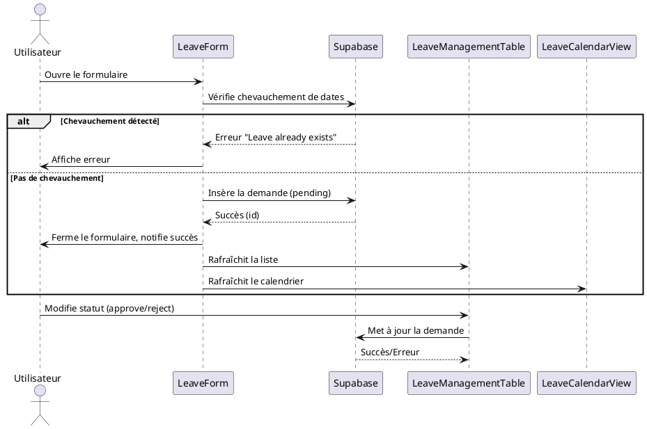

### Nom de la fonctionnalité & But
**Gestion des congés des employés (création, suivi, validation, visualisation)**

---

## Manuel d'utilisation

1. **Prérequi** :
   - Accès à l'application (interface Leave Management)
   - Compte Supabase configuré (variables `.env`)
   - Employés existants dans la base

2. **Démarrages** :
   - Accéder à la page "Leave Management"
   - Visualiser les demandes, planifier un congé, consulter le calendrier
   - Utiliser le bouton "Plan Leave" pour créer une nouvelle demande
   - Remplir le formulaire (employé, type, dates, raison)
   - Les managers peuvent approuver/rejeter/modifier les demandes

3. **Flux utilisateur** :
   - Un employé (ou RH) soumet une demande de congé
   - La demande apparaît dans la liste et le calendrier
   - Un manager peut modifier le statut (pending, approved, rejected)
   - Les statistiques sont visibles (par type, statut, solde)

---

## Diagramme UML de Séquence (PlantUML)



---

## Explication détaillée de la logique

### 1. Création d'une demande
- **Formulaire** : Saisie employé, type, dates, raison
- **Vérification** : Avant insertion, vérifie qu'aucun congé existant ne chevauche la période (requête Supabase)
- **Insertion** : Si OK, insère la demande avec statut `pending`

### 2. Visualisation et suivi
- **Tableau** : Affiche toutes les demandes (filtrage, tri, pagination)
- **Calendrier** : Vue calendrier des congés (affichage par employé, type, statut)
- **Statistiques** : Graphiques par type, statut, solde (ex : `LeavesTakenByType`, `LeaveRequestsByStatus`, `LeaveBalanceDistribution`)

### 3. Modification et validation
- **Edition** : RH/manager peut modifier une demande (dates, type, raison, statut)
- **Suppression** : RH/manager peut supprimer une demande
- **Statut** : Peut être changé (pending, approved, rejected)

### 4. Intégration Supabase
- **Table `leaves`** :
  - `employee_id` (FK), `type`, `start_date`, `end_date`, `duration`, `status`, `reason`
- **Requêtes** :
  - Sélection : récupération de toutes les demandes
  - Insertion : ajout d'une nouvelle demande
  - Update : modification du statut ou des champs
  - Delete : suppression d'une demande
- **Jointures** : Pour affichage, jointure avec `employees` pour nom/prénom

---

## Configuration & Setup

- **Variables d'environnement** :
  - `VITE_SUPABASE_URL`, `VITE_SUPABASE_ANON_KEY`
- **Table** :
  - `leaves` (voir database.md)
- **Dépendances** :
  - React, Supabase JS, react-table, react-big-calendar, ApexCharts

---

## Exemples d'utilisation avancés

```js
// Création d'une demande de congé
const { data, error } = await supabase
  .from('leaves')
  .insert([{ employee_id, start_date, end_date, type, reason, status: 'pending' }]);

// Récupération des congés (hook)
const { leaves, loading, error } = useFetchLeaves();

// Modification du statut
await supabase.from('leaves').update({ status: 'approved' }).eq('id', leaveId);

// Suppression
await supabase.from('leaves').delete().eq('id', leaveId);
```

---

## Liens & Références

- [Supabase documentation](https://supabase.com/docs)
- [react-table](https://react-table.tanstack.com/)
- [react-big-calendar](https://github.com/jquense/react-big-calendar)
- [ApexCharts](https://apexcharts.com/docs/react-charts/)
- Fichiers sources :
  - `src/pages/LeaveManagementPage.jsx`
  - `src/components/LeaveForm.jsx`
  - `src/components/LeaveManagementTable.jsx`
  - `src/components/LeaveCalendarView.jsx`
  - `src/hooks/useFetchLeaves.js` 