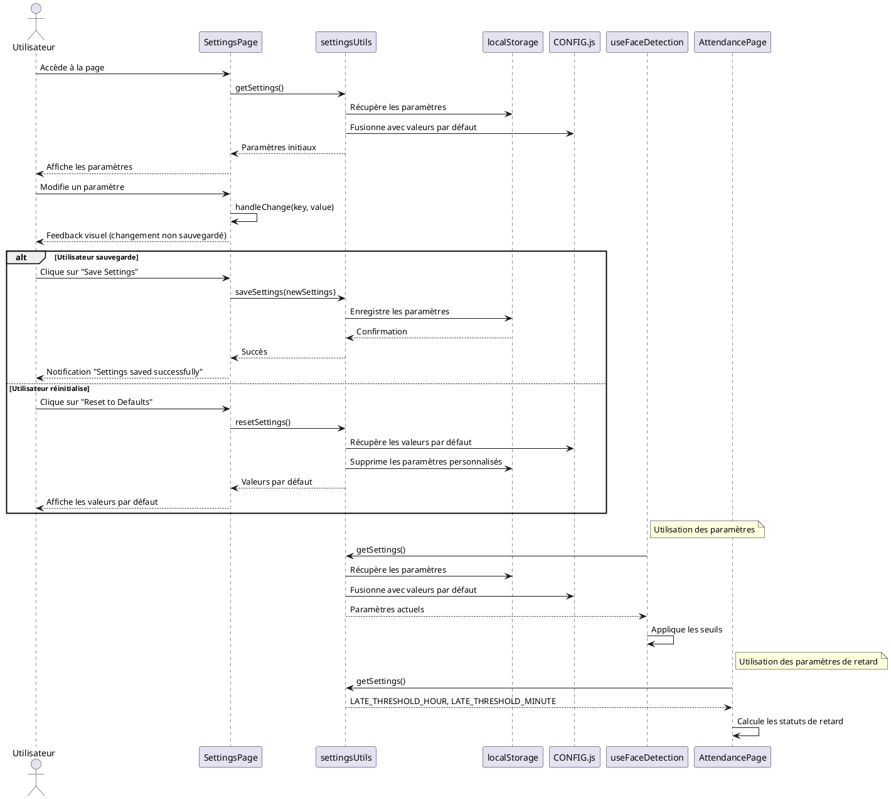

### Nom de la fonctionnalité & But
**Page de configuration des paramètres système pour la détection faciale et autres modules**

---

## Manuel d'utilisation

1. **Prérequis** :
   - Accès à l'application (interface administrateur)
   - Droits administrateur
   - Compréhension des impacts de modification des paramètres

2. **Démarrage** :
   - Accéder à la page "Settings" depuis le menu administrateur
   - Parcourir les différentes sections de paramètres, regroupées par catégorie
   - Modifier les valeurs via les curseurs ou champs numériques
   - Cliquer sur "Save Settings" pour appliquer les changements
   - Option "Reset to Defaults" pour revenir aux valeurs initiales

3. **Flux utilisateur** :
   - Un administrateur accède à la page des paramètres
   - Il ajuste les seuils pour la détection faciale, les critères de retard, etc.
   - Il sauvegarde les modifications qui sont stockées dans localStorage
   - Les valeurs sont appliquées lors des sessions futures d'utilisation

---

## Diagramme UML de Séquence (PlantUML)



---

## Explication détaillée de la logique

### 1. Architecture des paramètres
- **Source de vérité** : 
  - `CONFIG.js` contient les valeurs par défaut (seuils, intervalles)
  - `localStorage` stocke les modifications apportées par l'utilisateur
  - `settingsUtils.js` fournit les méthodes de lecture/écriture/réinitialisation
  - L'application utilise une fusion des deux (priorité à localStorage)

### 2. Catégories de paramètres
- **Détection faciale** :
  - `MIN_FACE_SCORE` : Score minimal pour accepter une détection (confiance)
  - `MIN_FACE_SIZE` : Taille minimale du visage dans l'image
  - `MAX_ANGLE` : Angle maximal de rotation du visage
  - `MIN_LANDMARKS_VISIBILITY` : Seuil de visibilité des points de repère
  
- **Reconnaissance faciale** :
  - `RECOGNITION_THRESHOLD` : Seuil de confiance pour la reconnaissance
  - `MAX_DETECTION_DISTANCE` : Distance euclidienne maximale pour un match

- **Présence et retards** :
  - `LATE_THRESHOLD_HOUR` : Heure limite pour l'arrivée sans retard
  - `LATE_THRESHOLD_MINUTE` : Minute limite pour l'arrivée sans retard

- **Performance** :
  - `DETECTION_INTERVAL` : Intervalle (ms) entre les cycles de détection
  - `REQUIRED_CONSECUTIVE_DETECTIONS` : Nombre minimal de détections consécutives

### 3. Interface utilisateur
- **Visualisation** :
  - Groupement par catégorie avec icônes thématiques
  - Affichage du titre, valeur actuelle et description
  - Curseurs pour les valeurs dans une plage continue
  - Feedback visuel (animation de pulsation) lorsque des changements non sauvegardés existent

- **Interactions** :
  - Modification des valeurs par glissement (curseurs) ou saisie directe
  - Boutons de sauvegarde et réinitialisation
  - Message de confirmation après sauvegarde réussie
  - Détection des changements en temps réel

### 4. Intégration avec d'autres modules
- **useFaceDetection** : utilise les paramètres pour contrôler le comportement de détection
- **AttendancePage** : utilise les seuils de retard pour déterminer le statut des pointages
- **Dashboard** : certains graphiques peuvent être influencés par les paramètres configurés

### 5. Persistance
- Utilisation de `localStorage` pour enregistrer les paramètres
- Clé de stockage constante `SETTINGS_STORAGE_KEY`
- Conservation des paramètres entre les sessions de l'utilisateur
- Réinitialisation possible à tout moment

---

## Configuration & Setup

- **Structure du module de paramètres** :
  ```js
  // CONFIG.js - Valeurs par défaut
  const CONFIG = {
    MIN_FACE_SCORE: 0.5,
    RECOGNITION_THRESHOLD: 0.8,
    LATE_THRESHOLD_HOUR: 8,
    LATE_THRESHOLD_MINUTE: 30,
    // Autres paramètres...
  };
  
  // settingsInfo.js - Métadonnées pour l'interface
  const settingsInfo = {
    MIN_FACE_SCORE: {
      title: 'Min Face Detection Score',
      description: 'Confiance minimale pour valider une détection faciale',
      type: 'range',
      min: 0,
      max: 1,
      step: 0.01,
      icon: 'activity',
      color: 'blue'
    },
    // Autres paramètres...
  };
  ```

- **Adaptations nécessaires** :
  - Ajout de nouveaux paramètres dans CONFIG.js et settingsInfo.js
  - Implémentation des validations dans les modules consommateurs

---

## Exemples d'utilisation avancés

```js
// Récupération des paramètres dans un autre module
import { getSettings } from '../utils/settingsUtils';
import CONFIG from '../utils/CONFIG';

const MyComponent = () => {
  // Utilisation dans un Hook React
  const [settings, setSettings] = useState(getSettings());
  
  // Utilisation des valeurs pour contrôler le comportement
  const detectFace = async (videoElement) => {
    const detections = await faceapi.detectAllFaces(
      videoElement,
      new faceapi.TinyFaceDetectorOptions({ minConfidence: settings.MIN_FACE_SCORE })
    );
    
    if (detections.length === 0) return null;
    
    // Filtre sur la taille du visage selon les paramètres
    const validSizeDetections = detections.filter(
      detection => 
        (detection.box.width >= settings.MIN_FACE_SIZE) && 
        (detection.box.height >= settings.MIN_FACE_SIZE)
    );
    
    // Autres logiques utilisant les paramètres...
    return validSizeDetections[0] || null;
  };
  
  // Reste du composant...
};

// Exemple d'ajout d'un nouveau paramètre
const extendConfig = (customParams) => {
  // Enregistrement de nouvelles valeurs
  const settings = getSettings();
  const newSettings = { ...settings, ...customParams };
  saveSettings(newSettings);
  
  // Notification à l'utilisateur
  alert('New parameters have been added. Please configure them in Settings.');
};
```

---

## Liens & Références

- [localStorage API](https://developer.mozilla.org/fr/docs/Web/API/Window/localStorage)
- [TensorFlow.js Model Parameters](https://www.tensorflow.org/js/guide/models_and_layers)
- [face-api.js Configuration](https://github.com/justadudewhohacks/face-api.js)
- Fichiers sources :
  - `src/pages/SettingsPage.jsx`
  - `src/utils/settingsUtils.js`
  - `src/utils/CONFIG.js` 